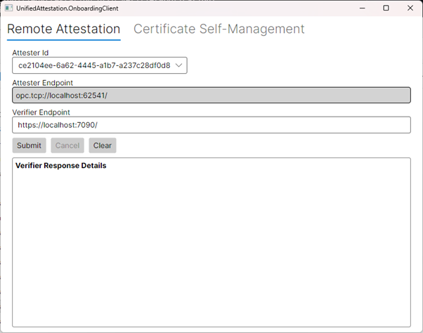
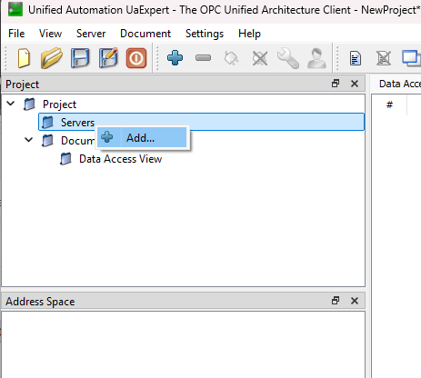
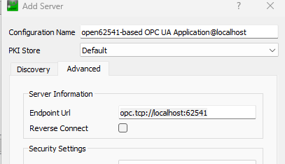
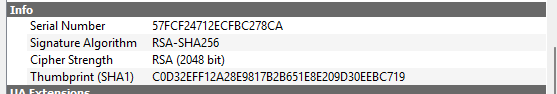
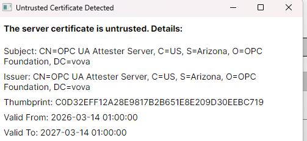
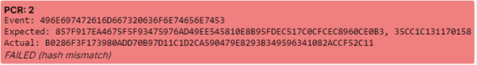
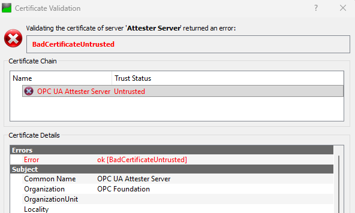
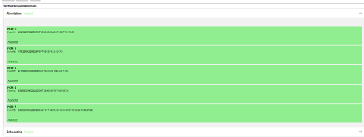
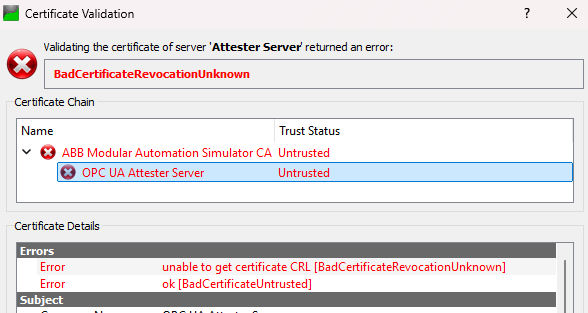

# Unified Attestation – OPC UA Onboarding Companion

## 1. Introduction

This is a companion repository showcasing how a RATS-based remote attestation workflow can be integrated into an OPC UA onboarding process.

## 2. Requirements

- .NET 10 is required to run this project
- Optionally, download **UAExpert** to easily inspect certificates on the attester

## 3. Simple Workflow Scenario Preparation

Navigate to the root of the project (`UnifiedAttestation` folder) and run `dotnet build` to build all components.

### 3.1 Starting a Corrupted Attester

Due to the way the project is set up, the attester must be started first so it can generate some important files.

1. Open a command line and navigate to:
```
   src\UnifiedAttestation.OpcUa.AttesterApplication\bin\Debug\net10.0\
```
2. Run:
```
   UnifiedAttestation.OpcUa.AttesterApplication.exe .\BootConfigs\boot2.json
```

### 3.2 Starting the Other Components

1. Open another command line, navigate to `src\UnifiedAttestation.Http.VerifierApplication\`, and run:
```
   dotnet run
```
   This starts the verification server.

2. Run the following executable to start the GDS:
```
   src\UnifiedAttestation.OpcUa.GDS\bin\Debug\net10.0\UnifiedAttestation.OpcUa.GDS.exe
```

3. Run the following executable to start the registrar (called *Onboarding Client* in the source code):
```
   src\UnifiedAttestation.OpcUa.OnboardingApplication\bin\Debug\net10.0\UnifiedAttestation.OpcUa.OnboardingApplication.exe
```

You should now see the onboarding client interface.



## 4. First Certificate Inspection

The `boot2.json` configuration contains deliberate deviations from the reference values loaded by the verifier on startup — the attestation should fail.

To inspect the current attestation certificate on the attester using UAExpert:

1. Start UAExpert. In the project panel, right-click **Servers** and select **Add…**



2. Go to the **Advanced** tab and enter the attester's endpoint URL in the **Endpoint URL** field. The default is:
```
   opc.tcp://localhost:62541
```



3. Click **OK**, then right-click the newly added server and click **Connect**.

> UAExpert does not trust certificates by default, so you will see a red warning — this can be safely ignored, as it does not affect the security of your system.


The key thing to note here is that the certificate is currently **self-signed**: there is only one entry in the certificate chain.

Scrolling down will reveal the certificate's thumbprint. Take note of it for later — your thumbprint will likely differ, as certificates are generated on demand.



Press **Cancel** to stop connecting.

## 5. First Attestation Attempt

In the Onboarding Client window, the verifier, attester, and GDS addresses will be pre-filled with correct defaults. Click **Submit**.

A warning will appear about an untrusted certificate. You can verify the thumbprint matches the one seen in UAExpert, then click **Trust** — the certificate will be temporarily trusted in the client only and will not be added to your system's trust store.



After clicking Trust, the server will perform attestation and report a **failure**. Expanding the attestation dropdown will show that attestation failed due to a PCR2 value mismatch with the reference values.



The onboarding status will show as **Unknown**. Since the process was aborted after attestation failed, the client was not onboarded and therefore did not receive a CA-signed certificate. You can confirm this by reconnecting to the attester in UAExpert — there should still be only one certificate in the chain.



## 6. Second Attestation Attempt

1. Shut down the attester by pressing `Ctrl+C` in its console.
2. Restart it with the correct boot config:
```
   UnifiedAttestation.OpcUa.AttesterApplication.exe .\BootConfigs\boot1.json
```
   This simulates reflashing the device with corrected software.

3. Go back to the Onboarding Client and click **Submit** again. You will be prompted to trust both the attester certificate and the GDS certificate. You can verify thumbprints by connecting to each in UAExpert (the GDS is at `opc.tcp://localhost:58810/GlobalDiscoveryServer/` by default) or by inspecting the certificates manually (on Windows, they are stored in `%ProgramData%\OPC Foundation`).

Once both certificates are trusted, attestation should complete successfully and both stages should be marked green.



To verify that the attester has received a CA-signed certificate, connect to it with UAExpert or inspect it manually. You should now see **two entries** in the certificate chain: one from the CA, and the attester certificate as the leaf node. Having received a CA-signed certificate, the attester is considered **onboarded**.


